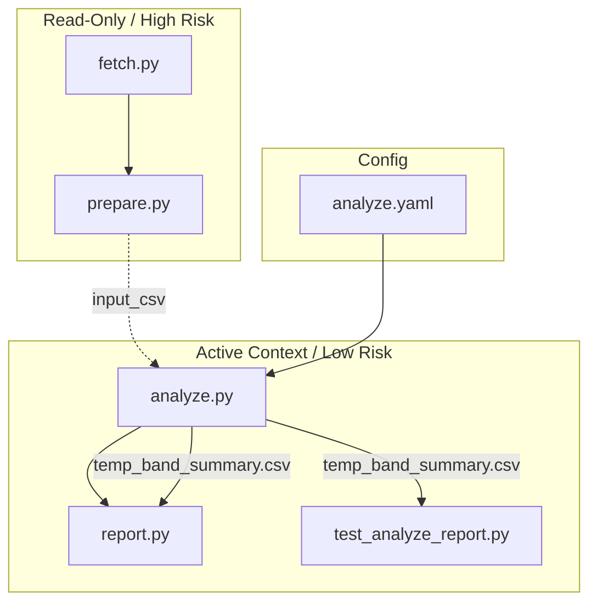

# Session Context Registry

## Active Task: Temperature-Band Summary (`feat/temp-band-summary`)

### 🗺️ Context Map
This diagram shows the relationship between our task and the repository surfaces.

### 📋 Context Bundle Log

| Task Slug | Spec Reference | Brief Reference | Context Bundle | Rationale |
| --- | --- | --- | --- | --- |
| `temp-band` | `01-task-spec.md` | `02-agent-brief.md` | `analyze.py`, `report.py`, `test_analyze_report.py`, `analyze.yaml` | Downstream implementation and verification only. |

### 🛠️ Verification Trace
- [x] Baseline Workflow Run (`baseline`)
- [x] Task Spec Approved
- [x] Agent Brief Approved
- [x] Implementation Plan Reviewed
- [x] Final Verification Passed
- [x] Review & Decision Recorded
- [x] Hardening Note Approved

## 📊 Resource Management

| Metric | Current Value | Threshold | Status |
| --- | --- | --- | --- |
| Context Window Usage | ~8% (Estimated) | 60% | ✅ Healthy |
| Estimated Total Tokens | ~12,400 (Input: 11k, Output: 1.4k) | N/A | ✅ Optimized |
| Active File Context | 4 files (~450 lines) | < 10 files | ✅ Bounded |
| Implementation Diffs | ~45 lines | < 200 lines | ✅ Bounded |

> **Context Composition**: The active context includes the target source files (`analyze.py`, `report.py`), verification logic (`test_analyze_report.py`), and configuration (`analyze.yaml`). This lean context minimizes "noise" and ensures high-fidelity reasoning for the Temperature-Band feature.
