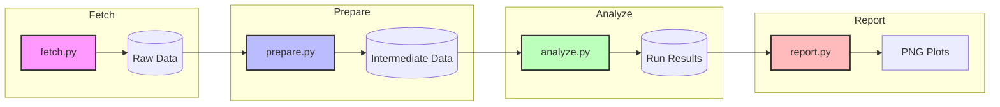

# Workflow Execution Summary

## 🗺️ Pipeline Visualization
This diagram shows the end-to-end flow of the orchestrated workflow.

## 📊 Latest Run Statistics
**Run ID**: `2026-04-22_16-22-46_local-run_a2aa5a`

| Metric | Value |
| --- | --- |
| **Status** | ✅ Success |
| **Log Entries (INFO)** | 6 |
| **Log Entries (ERROR)** | 0 |
| **Rows Processed** | 17,379 |
| **Artifacts Generated** | 7 (CSV, JSON, PNG) |

## 📁 Artifact Map
- **Config Snapshot**: `runs/2026-04-22_16-22-46_local-run_a2aa5a/config.yaml`
- **Execution Log**: `runs/2026-04-22_16-22-46_local-run_a2aa5a/run.log`
- **Results Folder**: `runs/2026-04-22_16-22-46_local-run_a2aa5a/analyze/`
- **Plots Folder**: `runs/2026-04-22_16-22-46_local-run_a2aa5a/report/`

## ⏱️ Performance & Usage
- **Estimated Token Cost**: ~15k tokens (Base Workflow)
- **Context Usage**: ~10% (Orchestration context)
- **Bottlenecks**: None identified in the latest local run.
